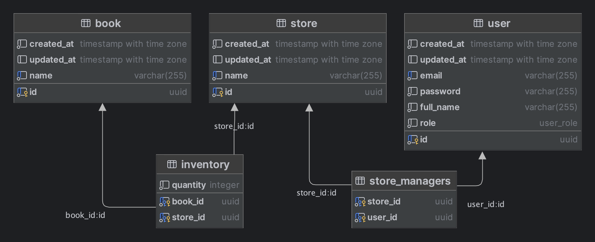

## Book Store


## Installation and Running the app

#### 1. Clone the repository
#### 2. Copy the .env.local file to .env
```bash
cp .env.local .env
```
#### 3. Run docker compose
```bash
docker-compose up -d
```
*API runs on <a href="http://localhost:3000" target="blank">localhost:3000</a>, postgres runs on **::5432** by default*

#### 4. Seed the database
```bash
npm run migration:seed
```
### Default Users
| User | Email            | Password(*decoded*)  | Full Name   | 
|------|------------------|----------------------|-------------|
| #1   | user@mail.com    | password             | User Doe    |
| #2   | manager@mail.com | password             | Manager Doe |
| #3   | admin@mail.com   | password             | Admin Doe   |

---

### Database Diagram

---
### API Documentation
**Postman: [Book Store API.postman_collection.json](Book%20Store%20API.postman_collection.json)**

#### Authentication
`[GET] /auth/me`: Returns the current user's information. [Requires Authentication]

`[POST] /auth/sign-up`: Register a new user [Public]

`[POST] /auth/sign-in`: Login a user [Public]
#### User
`[GET] /user`: Returns a list of users. [Required Roles: `admin`]

`[POST] /user`: Create a new user. [Required Roles: `admin`]
#### Book
`[GET] /book`: Returns a paginated list of books. [Requires Authentication]

`[POST] /book`: Create a new book. [Required Roles: `admin`]
#### Store
`[GET] /store`: Returns a list of stores. [Required Authentication]

`[POST] /store`: Create a new store. [Required Roles: `admin`]

`[PUT] /store/adjust-inventory`: Adjust the inventory of a store. [Required Roles: `manager` or `admin`]
